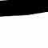

# TD3 Car Environment 

## Tasks Done to understand the environment:

* **Bullet Ant Environment:**

  [**Notebook**](Reinforcement_learning_Ant_Bullet_Environment_.ipynb)
  
  **Result:**
  
  

* **Walker 2D bullet Environment:**

  [**Notebook**](Reinforcement_learning_Walker2D_Bullet_Environment_.ipynb)
  
  **Result:**
  
  

* **Half Cheetah Environment:**

  [**Notebook**](Reinforcement_learning_Half_Cheetah_Bullet_Environment_.ipynb)
  
  **Result:**
   
  

## Failed Attempts

Things I tried to create the custom environment

**1. Created PyGame**

[Game Code](Car_Game)

[Result](Car_Game/game.png)

**2. Integrating with gym environment**

I couldn't integrate it with gym as there is very less documentation, need more time for that. 
I tried also to integrate it directly with gym environemnt.. ended up the same..
most of my time went into that

## Running Attempt:

**Steps:**

[Code](Kivy_Sensor_TD3_Environment/)
* Took Kivy Environment.
* Tried over sensor enviroment.
* Removed A3C and Loaded TD3.
  * Removed Array of rotation and made it to a single continous value given by the model.
  * Added episodes ot the environemnt
  * Added done state:
    * If the car reaches destination
    * If car crosses episodes tiem stamps
 * Click on the lmage below to take you to the video.
 
 
 
 * First part of video is over a batch of 100 and memory size of 1000, due to Hardware capacity it crashes. Hence lowered memory size to 100 and batch size to 10.. if you look at the video that he actor is running but slowly. Hence hardware needs to be updated.. but he code runs without errors!!
 * Captured Images of current car location. 
 
 **Cropped Image gif-70 frames**
 
 

## Need time for:

* Complete the kivy environment.
* COmplete the custom GYM environment.
    
  
